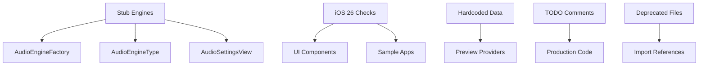

# Design Document

## Overview

The mock data cleanup feature will systematically remove all placeholder, stub, and test code from the Fonic HiFi project through a coordinated approach that ensures no build breaks or functionality loss. The cleanup addresses five main categories: stub engine implementations, iOS 26 availability checks, hardcoded test data, TODO comments, and deprecated files.

## Architecture

### Cleanup Strategy

The cleanup follows a dependency-aware approach where interconnected components are updated together to prevent build failures:

1. **Dependency Mapping**: Identify all references to stub implementations before removal
2. **Coordinated Updates**: Update factory classes, enums, and UI components simultaneously
3. **Validation**: Verify each cleanup step maintains project functionality
4. **Progressive Cleanup**: Handle critical items first, then lower-priority items

### Component Dependencies



## Components and Interfaces

### 1. Stub Engine Removal Component

**Purpose**: Remove non-functional audio engine implementations and their dependencies

**Files Affected**:
- `FFmpegEngineAdapter.swift` (DELETE)
- `SFBAudioEngineAdapter.swift` (DELETE)
- `AudioEngineFactory.swift` (UPDATE)
- `AudioEngineType.swift` (UPDATE)
- `AudioSettingsView.swift` (UPDATE)

**Interface Changes**:
```swift
// AudioEngineType.swift - Remove cases
public enum AudioEngineType: String, CaseIterable, Sendable {
    case avAudioEngine = "AVAudioEngine"
    case audioKitEngine = "AudioKitEngine"
    // REMOVE: case sfbAudioEngine = "SFBAudioEngine"
    // REMOVE: case ffmpegEngine = "FFmpegEngine"
}

// AudioEngineFactory.swift - Remove availability flags
private var availableEngines: [AudioEngineType: Bool] = [
    .avAudioEngine: true,
    .audioKitEngine: true
    // REMOVE: .sfbAudioEngine: false
    // REMOVE: .ffmpegEngine: false
]
```

### 2. iOS 26 Availability Cleanup Component

**Purpose**: Remove all iOS version availability checks since project targets iOS 26+

**Files Affected**:
- `BottomSearchBar.swift`
- `LiquidGlassRail.swift`
- `LiquidGlassTabBar.swift`
- `PerformanceOptimizedContainer.swift`
- `iOS26_Features_Documentation.swift`
- Sample app files

**Pattern Replacement**:
```swift
// BEFORE
if #available(iOS 26, *) {
    // iOS 26+ code
} else {
    // Fallback code
}

// AFTER
// iOS 26+ code (no availability check needed)
```

### 3. Preview Data Standardization Component

**Purpose**: Replace hardcoded strings with structured preview data models

**Interface Design**:
```swift
// New preview data structure
struct PreviewData {
    static let sampleTrack = Track(
        title: "Sample Track",
        artist: "Sample Artist",
        album: "Sample Album",
        // ... other properties
    )
    
    static let sampleAudioFile = AudioFileInfo(
        name: "Sample Song.mp3",
        // ... other properties
    )
}
```

### 4. TODO Comment Resolution Component

**Purpose**: Either implement or remove all TODO comments from production code

**Categories**:
- **Implementable TODOs**: Convert to actual implementations
- **Unimplementable TODOs**: Remove entirely
- **Future TODOs**: Move to issue tracker or documentation

### 5. File Cleanup Component

**Purpose**: Remove deprecated and obsolete files

**Files to Remove**:
- `TabBarMiniPlayer.swift`
- Potentially sample folder contents (after evaluation)

## Data Models

### Cleanup Task Model

```swift
struct CleanupTask {
    let id: String
    let type: CleanupType
    let priority: Priority
    let files: [String]
    let dependencies: [String]
    let validation: ValidationStep
}

enum CleanupType {
    case stubRemoval
    case availabilityCheck
    case hardcodedData
    case todoComment
    case deprecatedFile
}

enum Priority {
    case critical
    case high
    case medium
    case low
}
```

### Validation Model

```swift
struct ValidationStep {
    let buildCheck: Bool
    let functionalityCheck: Bool
    let searchPatterns: [String]
    let expectedResults: [String]
}
```

## Error Handling

### Build Failure Prevention

1. **Dependency Validation**: Check all references before removing files
2. **Incremental Updates**: Update related files in the same commit
3. **Compilation Checks**: Verify build success after each major change
4. **Rollback Strategy**: Maintain ability to revert changes if issues arise

### Validation Failures

1. **Search Pattern Mismatches**: Re-run cleanup if patterns still found
2. **Functionality Regression**: Identify and fix broken features
3. **Missing Dependencies**: Add required imports or implementations

## Testing Strategy

### Automated Validation

```bash
# Search pattern validation
make search PATTERN='mock|Mock|MOCK'
make search PATTERN='TODO|FIXME'
make search PATTERN='"Test |"Sample |"Example '
make search PATTERN='if #available|@available'

# Build validation
xcodebuild -project "Fonic HiFi.xcodeproj" -scheme "Fonic HiFi" build

# Functionality validation
# Run existing test suite to ensure no regressions
```

### Manual Testing

1. **Audio Engine Selection**: Verify only functional engines appear in settings
2. **Preview Rendering**: Confirm all SwiftUI previews still work
3. **App Functionality**: Test core features remain intact
4. **UI Consistency**: Verify no visual regressions from availability check removal

### Validation Checklist

- [ ] Project builds successfully
- [ ] No mock variables in production code
- [ ] No TODO comments in production code
- [ ] No hardcoded test strings in production code
- [ ] No iOS availability checks in production code
- [ ] All SwiftUI previews render correctly
- [ ] Audio settings only show functional engines
- [ ] Core app functionality works as expected

## Implementation Phases

### Phase 1: Critical Cleanup (Immediate)
1. Remove stub engine implementations
2. Remove iOS 26 availability checks
3. Delete deprecated files

### Phase 2: Code Quality (High Priority)
1. Replace hardcoded preview data
2. Resolve TODO comments
3. Clean up mock return values

### Phase 3: Organization (Medium Priority)
1. Evaluate sample folder
2. Update documentation
3. Optimize search patterns

### Phase 4: Validation (Ongoing)
1. Run verification commands
2. Perform manual testing
3. Document cleanup results

## Risk Mitigation

### Build Breakage Risk
- **Mitigation**: Update all dependent files simultaneously
- **Detection**: Automated build checks after each change
- **Recovery**: Git revert capability for each cleanup step

### Functionality Loss Risk
- **Mitigation**: Preserve all working code, only remove non-functional stubs
- **Detection**: Manual testing of core features
- **Recovery**: Detailed change documentation for rollback

### Preview Breakage Risk
- **Mitigation**: Test preview rendering after data model changes
- **Detection**: SwiftUI preview compilation checks
- **Recovery**: Fallback to simple preview implementations if needed