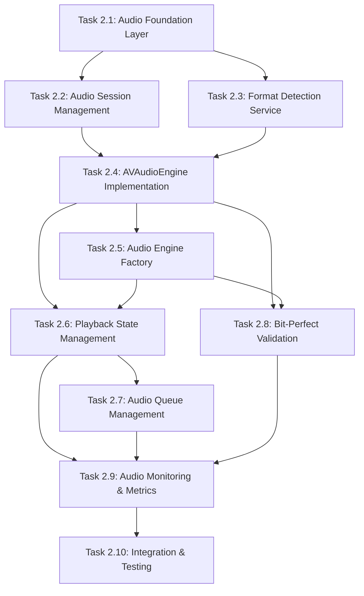

# Milestone 2: Task Dependencies & Execution Order

## Dependency Graph



## Execution Phases

### Phase 1: Foundation (Day 1-2)
**Can be done in parallel:**
- ✅ Task 2.1: Audio Foundation Layer
  - No dependencies
  - Creates base types all other tasks need
  - Time: 2-3 hours

**Sequential after 2.1:**
- ✅ Task 2.2: Audio Session Management 
  - Depends on: Task 2.1 (AudioError types)
  - Time: 3-4 hours
  
- ✅ Task 2.3: Format Detection Service
  - Depends on: Task 2.1 (AudioFormat enum)
  - Time: 4-5 hours

### Phase 2: Core Implementation (Day 3-4)
**Must be done sequentially:**
- ✅ Task 2.4: AVAudioEngine Implementation
  - Depends on: Tasks 2.1, 2.2, 2.3
  - Blocks: Tasks 2.5, 2.6, 2.8
  - Time: 6-8 hours

- ✅ Task 2.5: Audio Engine Factory
  - Depends on: Task 2.4
  - Time: 2-3 hours

- ✅ Task 2.6: Playback State Management
  - Depends on: Tasks 2.4, 2.5
  - Time: 3-4 hours

### Phase 3: Advanced Features (Day 5-6)
**Can be done in parallel:**
- ✅ Task 2.7: Audio Queue Management
  - Depends on: Task 2.6
  - Time: 4-5 hours

- ✅ Task 2.8: Bit-Perfect Validation
  - Depends on: Tasks 2.4, 2.5
  - Time: 3-4 hours

### Phase 4: Polish & Integration (Day 7)
- ✅ Task 2.9: Audio Monitoring & Metrics
  - Depends on: Tasks 2.6, 2.7, 2.8
  - Time: 3-4 hours

- ✅ Task 2.10: Integration & Testing
  - Depends on: All previous tasks
  - Time: 4-6 hours

## Critical Path
The longest sequence of dependent tasks:
```
2.1 → 2.2 → 2.4 → 2.5 → 2.6 → 2.7 → 2.9 → 2.10
```
Total critical path time: ~35 hours

## Parallelization Opportunities

### Parallel Track 1:
- Task 2.1 (start)
- Task 2.2 (after 2.1)
- Task 2.4 (after 2.2)

### Parallel Track 2:
- Task 2.1 (start)
- Task 2.3 (after 2.1)
- Can assist with 2.4 testing

### Later Parallelization:
- Tasks 2.7 and 2.8 can be done simultaneously
- Different developers can work on each

## Interface Dependencies

### Task 2.1 provides to all:
```swift
- AudioFormat enum
- AudioError enum  
- AudioEngineConfiguration struct
- AudioEngineService protocol
```

### Task 2.2 provides to 2.4:
```swift
- Configured AVAudioSession
- Route change handling
- Interruption handling
```

### Task 2.3 provides to 2.4, 2.5:
```swift
- AudioFileInfo struct
- Format detection logic
- File validation
```

### Task 2.4 provides to 2.5, 2.6, 2.8:
```swift
- Working AVAudioEngine implementation
- Playback control methods
- Audio pipeline setup
```

### Task 2.6 provides to 2.7, 2.9:
```swift
- PlaybackState enum
- State change notifications
- Current playback info
```

## Risk Mitigation

### Blocking Risks:
1. **Task 2.1 delays** block everything
   - Mitigation: Start immediately, review quickly
   
2. **Task 2.4 complexity** blocks 3 tasks
   - Mitigation: Create minimal version first, enhance later

3. **Task 2.10 reveals issues** requires rework
   - Mitigation: Test continuously, not just at end

### Technical Risks:
1. **Audio session conflicts** (Task 2.2)
   - Test with other audio apps
   
2. **Format detection accuracy** (Task 2.3)
   - Build comprehensive test suite early

3. **Performance issues** (Task 2.9)
   - Monitor from the start, not as afterthought

## Testing Strategy Per Task

### Task 2.1: Foundation
- Unit tests for enums and structs
- Protocol conformance tests

### Task 2.2: Session Management
- Test interruption scenarios
- Route change testing (headphones, speaker)

### Task 2.3: Format Detection
- Test suite with all supported formats
- Corrupted file handling

### Task 2.4: AVAudioEngine
- Playback state transitions
- Memory leak testing
- Performance benchmarks

### Task 2.5: Engine Factory
- Correct engine selection
- Fallback mechanisms

### Task 2.6: State Management
- State machine validation
- Thread safety tests

### Task 2.7: Queue Management
- Queue operations accuracy
- Shuffle algorithm distribution

### Task 2.8: Bit-Perfect
- Hardware capability detection
- Sample rate matching

### Task 2.9: Monitoring
- Metric accuracy
- Performance overhead

### Task 2.10: Integration
- End-to-end workflows
- Stress testing